# NPG Lite SNES

**Play video games using your mind and body.**

This app connects to the Neuro Playground (NPG) Lite over Bluetooth to read your body's electrical signals (EMG, EEG, EOG, ECG). It records these bio-potential signals like flexing a muscle, blinking your eyes, clenching your jaw, or focusing and converts them into standard Xbox controller button presses. This lets you play almost any PC game using just your mind and body.

## Features

- **Wireless:** Connects wirelessly to the NPG Lite device via Bluetooth Low Energy (BLE).
- **Up to 6 Bio-potential Signals:** Supports up to 6 channels processing muscles (EMG), brainwaves and blinks (EEG), eye movements (EOG), and heartbeats (ECG).
- **Custom Mapping:** A simple UI that lets you choose which action (like a "Double Jaw Clench") triggers which button (like the "A" button or "DPAD" keys).
- **Zero Config:** The app automatically handles and installs the required virtual Xbox controller driver (`ViGEmBus`) on Windows for you.
- **Built-in Tester:** See your body signals light up in real-time and test your virtual controller before jumping into a game.

## Tutorial Video


## Requirements

- A Windows PC with Bluetooth
- NPG Lite ([Explorer, Ninja or Beast pack](https://docs.upsidedownlabs.tech/hardware/bioamp/neuro-play-ground-lite/index.html))
- BioAmp snap cables and gel electrodes (2 per signal, plus 1 shared reference)
- NuPrep skin preparation gel (optional) and alcohol swabs
- USB Type-C cable

## Setup

### 1. Flash the firmware

1. Turn on your NPG Lite using the power switch and make sure the battery is connected correctly.
2. Connect the NPG Lite to your computer with the USB Type-C cable.
3. Open [NPG-Lite-Flasher-Web](https://upsidedownlabs.github.io/NPG-Lite-Flasher-Web/) in a Chromium-based browser (Chrome, Edge, Brave, etc.).
4. Click **Connect** and select the USB device named **USB JTAG**.
5. Select the **BLE Wireless** firmware and click **Flash**.
6. Wait a few seconds while the firmware is uploaded, then disconnect the USB cable.

### 2. Prepare your skin

Good skin preparation gives a much cleaner signal.

1. Clean the areas where the electrodes will go with an alcohol swab or wet wipe.
2. For an even better signal, you can first apply a small amount of NuPrep skin preparation gel and then clean the skin.
3. Let the skin dry before placing the electrodes.

### 3. Place the electrodes

Choose the signals you want to use and place the electrodes as shown in the diagrams. Each signal needs one **positive (red)** and one **negative (black)** electrode. The diagrams also show a reference (yellow) electrode, but you only need **one reference electrode for everything**. Place it on a bony part of the body, for example behind an ear or on the wrist.

**EMG (flexing a muscle):** place the positive and negative electrodes close together on the muscle you will flex, for example your forearm.

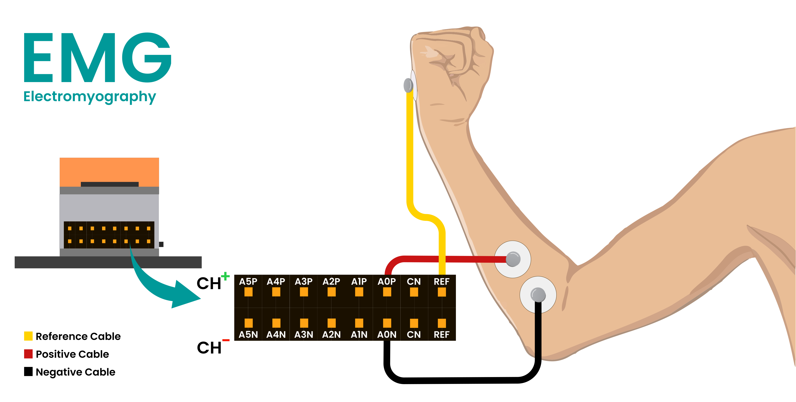

**EEG (focus, blink, jaw clench):** place the positive electrode on the centre of your forehead and the negative electrode behind one ear.


**EOG (eye movement):** place the negative electrode at the outer corner of your right eye and the positive electrode at the outer corner of your left eye. If left and right eye movements appear swapped in the app, swap the red and black cables.

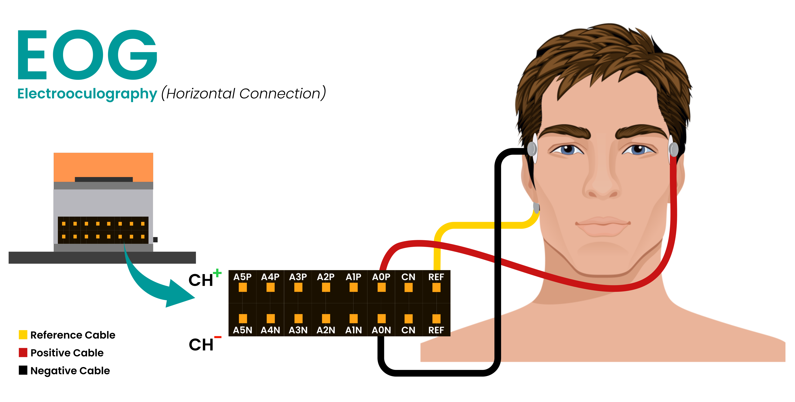

**ECG (heartbeat):** place the negative electrode on the left side of your chest just below the collarbone, and the positive electrode slightly to its right with a small gap between them.

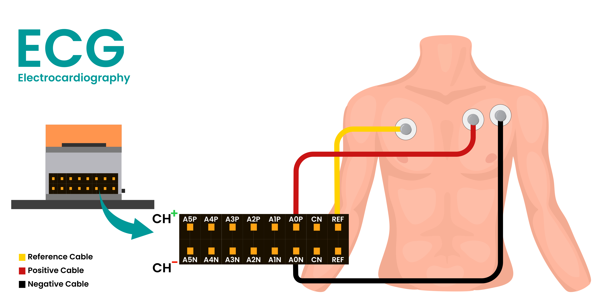

### 4. Connect the cables

Connect the red and black cables of each signal to the **+** and **-** pins of one channel, and the reference cable to **REF**. You can use any channel for any signal.

| Channel | + pin | - pin |
| --- | --- | --- |
| Channel 1 | A0P | A0N |
| Channel 2 | A1P | A1N |
| Channel 3 | A2P | A2N |
| Channel 4 | A3P | A3N |
| Channel 5 | A4P | A4N |
| Channel 6 | A5P | A5N |

> **Note:** Only the NPG Lite Beast pack comes with 6 channels. The Explorer and Ninja packs support only 3 channels.

Remember which channel you used for each signal, because you will select it in the app. For example: EMG on Channel 1, EEG on Channel 2 and EOG on Channel 3.

## How to use it

The easiest way to use the app is to grab the pre-built standalone `.exe` file.

1. Download the latest `NPG-Controller.exe` from the [Releases](https://github.com/upsidedownlabs/NPG-Lite-SNES/releases) / GitHub Actions tab.
2. Double-click the file to open it. If it's your first time running the app, it will ask for admin permissions to quickly install the `ViGEmBus` driver. This allows Windows to see your body as a real Xbox controller.
3. Follow the steps below.

### Step 1: Connect

Turn on your NPG Lite with the On/Off switch and click **CONNECT**. The app scans for NPG Lite devices for up to 10 seconds and connects to yours. If it finds more than one, pick yours from the list. When it is connected, the button changes to **DISCONNECT**, and the battery level and "Virtual gamepad connected" appear at the bottom left.

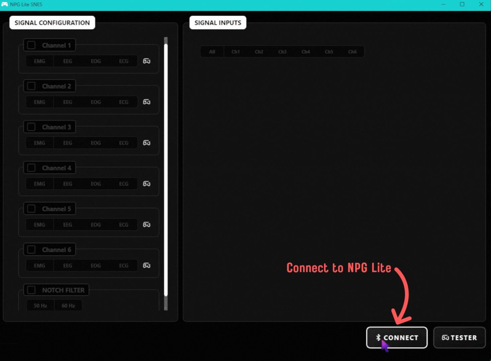

### Step 2: Select the channels

Tick the box of every channel you connected in the setup. Only ticked channels are used.

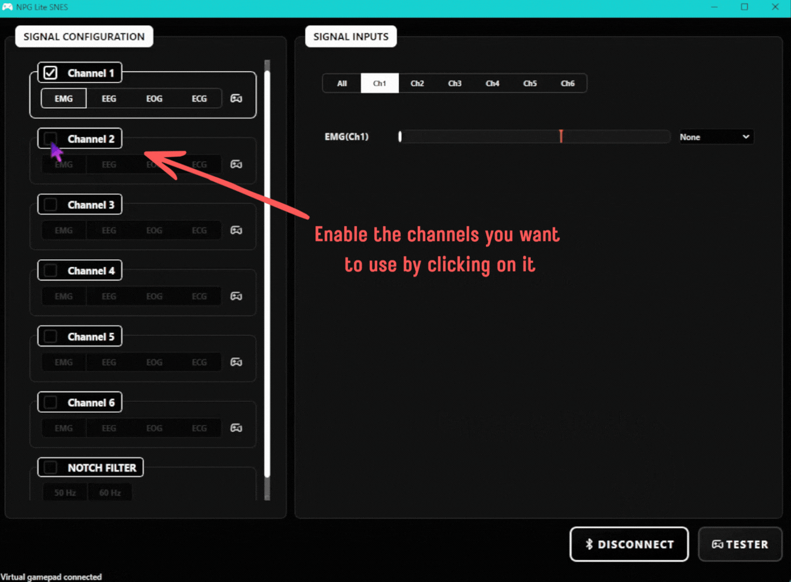

### Step 3: Select the filters

For each ticked channel, choose the signal it records: **EMG**, **EEG**, **EOG** or **ECG**. This applies the right filters for that signal. EEG, EOG and ECG can each be used on only one channel, and any other channels must be EMG.

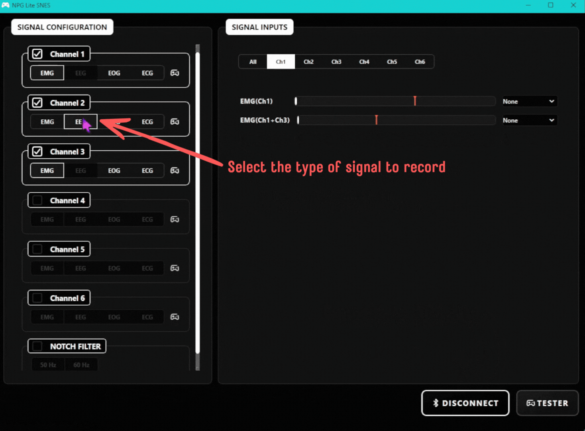

### Step 4: Enable the notch filter

Tick **NOTCH FILTER** and choose **50 Hz** or **60 Hz** to match the power line frequency in your region. Most countries use 50 Hz, and countries like the USA and Canada use 60 Hz. This removes power line noise from the signals.

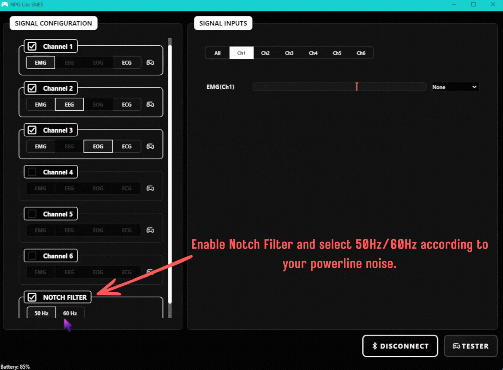

### Step 5: Set the thresholds

In the **Signal Inputs** panel, open the tab of a channel (or **All**). Each signal has a bar with a red marker, which is its threshold. Perform the gesture and watch the bar. When the signal goes past the marker, the gesture is detected. Drag the marker to just below the level your gesture reaches, and above the level when you are relaxed, so it does not trigger by accident.

The signals you can set, depending on the type you chose in Step 3:

- **EMG:** one bar for each EMG channel. With two or more EMG channels, extra bars such as `EMG(Ch1+Ch3)` appear for using both muscles together.
- **EEG:** Focus, Blink and Jaw Clench.
- **EOG:** Left Eye, Right Eye and Jaw Clench.
- **ECG:** your heartbeat.

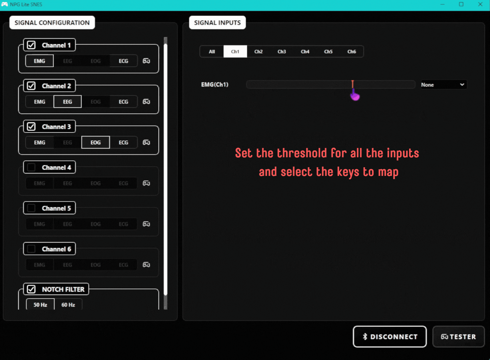

### Step 6: Map the gestures to controller keys

Next to each bar, use the drop-down to choose the controller key that the gesture presses: **A, B, X, Y, Dpad Up, Dpad Down, Dpad Left, Dpad Right, L, R** or **Start**. Choose **None** to leave a gesture unused. The key stays pressed for as long as the gesture is detected.

For EEG channels, you can also tick **Double Blink** or **Triple Blink**, and for EEG and EOG channels **Double Jaw Clench**, then choose a key for each. These press the key once each time you do the gesture.

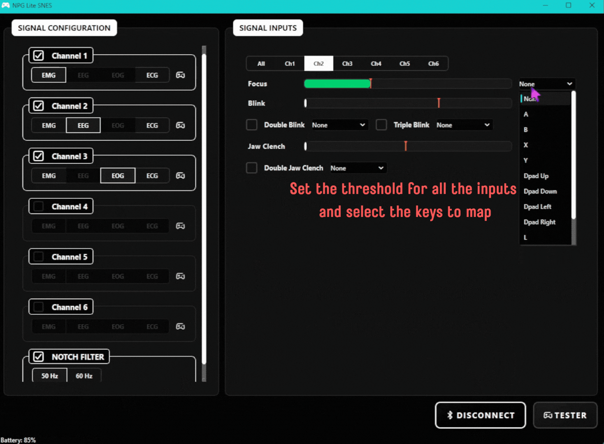

### Step 7: Test the controls

Click **TESTER** to open a virtual SNES controller. Perform your gestures and watch the matching buttons light up. If a button lights up by mistake or does not light up, go back and adjust its threshold or key. Click **CLOSE TESTER** when you are done.

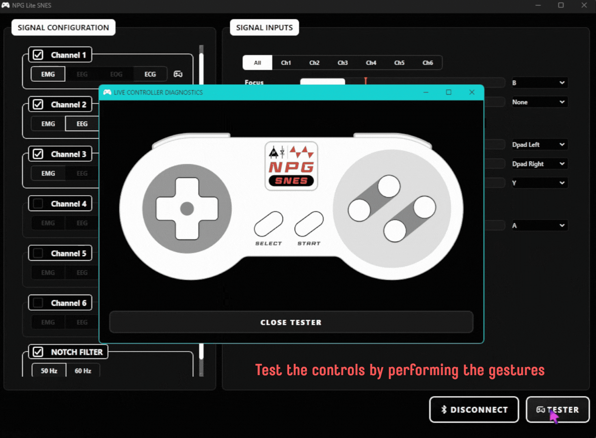

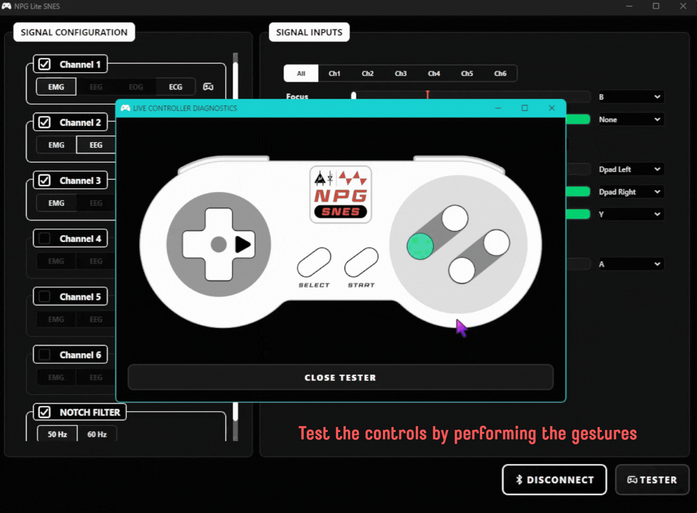

Once everything works, open your game. It sees your body as a real Xbox controller, so you can launch it and play!

## Running from source (For developers)

If you want to view or edit the code directly, you need a Windows PC with Python 3.11.

1. Clone this repository to your PC.
2. Open a terminal in the project folder, then create and activate a virtual environment:
   ```bash
   python -m venv .venv
   .venv\Scripts\activate
   ```
3. Install the required libraries:
   ```bash
   pip install -r requirements.txt
   ```
4. Run the main script:
   ```bash
   python main.py
   ```

The first time you run it on a PC that does not have the `ViGEmBus` driver, the app downloads the installer and Windows asks for admin permission to install it.

### Building the .exe yourself
After step 3 above, run:
```bash
pyinstaller build.spec
```
The `.exe` is created in the `dist` folder as `NPG Lite SNES.exe`. The first build downloads the `ViGEmBus` installer (about 6 MB) and bundles it into the `.exe`.
